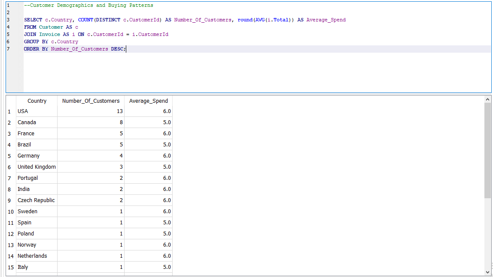

# Analysis Descriptions
1. Customers Buying Two Tracks for $0.99 Each:
- This query selects invoices where the total amount equals $1.98, indicating customers who bought exactly two tracks priced at $0.99 each. It orders the results by the invoice date to show the chronological order of such purchases.

2. Most Common Billing Countries:
- Calculates the number of invoices per billing country to identify the most common countries where customers purchase. The descending number of invoice orders results in highlighting the top countries.

3. Total Revenue Over Time:
- Group revenue by month and year to analyze the company's total revenue trends over time. It helps in understanding seasonal variations and overall growth.

4. Best Selling Albums:
- Identifies the top 10 best-selling albums based on the quantity of tracks sold. This query links albums to tracks and invoice lines, grouping by album and ordering by the total units sold.

5. Customer Demographics and Buying Patterns:
- Analyzes customer demographics by country, counting the unique number of customers and calculating the average spend per invoice. It orders countries by the number of customers to identify the largest markets.

6. Top Selling Artists:
- Finds the top 10 artists generating the most revenue, calculated by multiplying the unit price by the number of tracks sold. It orders artists by their total revenue contribution.

7. Most Popular Genres:
- Determines the top 10 most popular music genres based on total sales. It shows which genres are most successful in terms of quantity sold.

8. Sales Performance by Employee:
- Evaluates total sales generated by each employee, indicating their performance in generating revenue for the company. It groups sales by employee and orders them by total sales.

9. Employees Responsible for the Highest Individual Sales:
- Lists the top 10 invoices with the highest totals, showing which employees were responsible for these sales. It's useful for identifying standout sales performances.

10. Average Invoice Totals by City:
- Calculates the average invoice total for each billing city to analyze geographical differences in spending. It groups results by city and orders alphabetically.

11. City Performance Against Global Average Sales:
- Compares the average invoice total of each city against the global average, providing insight into how each city performs relative to the overall average.

12. Playlist Popularity:
- Ranks playlists by the number of tracks they contain, showing which playlists are the most populated. This can indicate popular music curation trends.

13. Selling Tracks per Country:
- Analyzes the total number of tracks sold and total sales revenue by country, ordering results to highlight top-performing countries in both metrics.

14. Invoices Below Average Total:
- Selects invoices where the total is less than the average invoice total, ordered by descending total. This can identify smaller transactions and customer segments that contribute to lower-value sales.

15. Effect of Music Genre on Sales by Country:
- Examines how music genre sales vary by country, grouping sales by genre and country. It orders results to show which genres are most popular in each country.

16. Sales by Year and Genre:
- Analyzes sales revenue by year and genre, providing insights into how music genres perform financially over time. It groups results by year and genre, highlighting trends and changes in consumer preferences.

